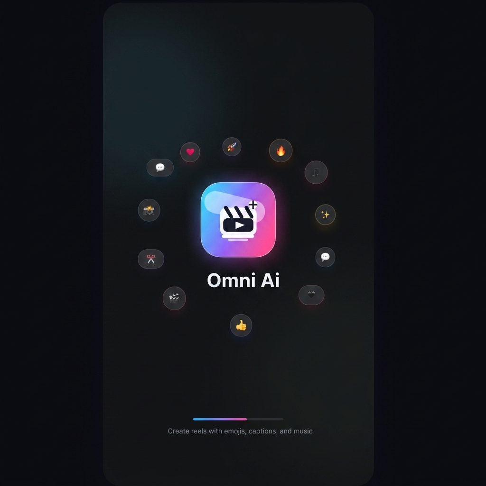
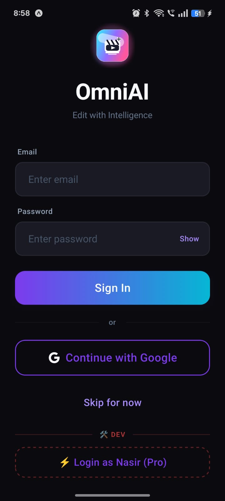
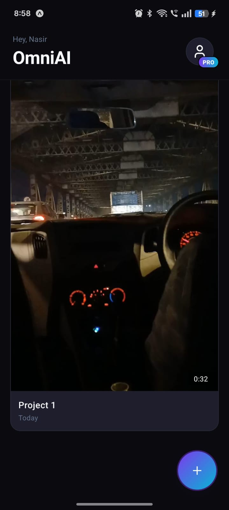
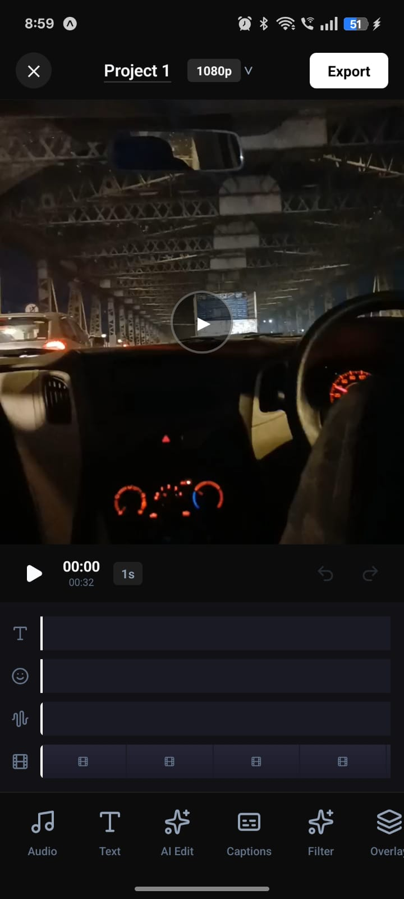
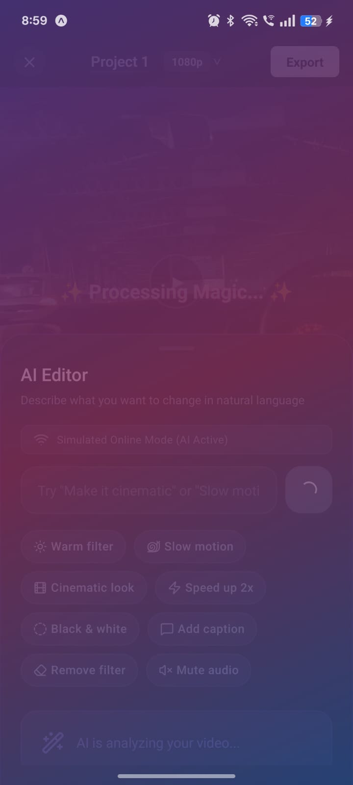
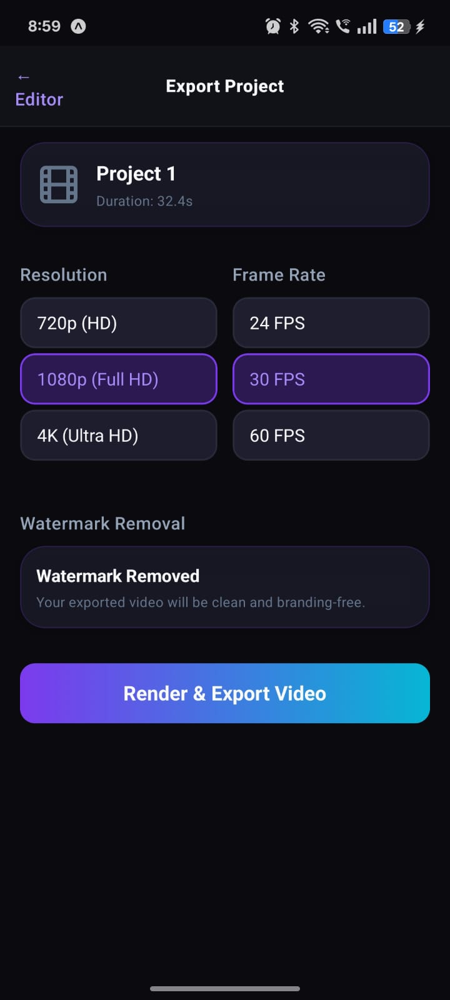
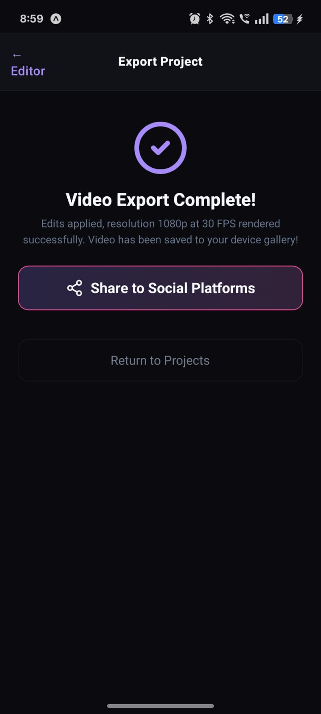
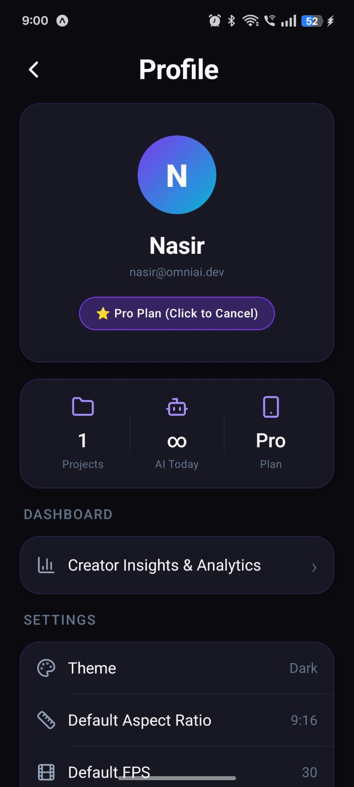

# omniAi 🚀

Welcome to **omniAi**, the next-generation AI-powered mobile application designed to redefine how you edit, create, and share your videos on the go. 

🎥 **Watch the project video here:** [url to this video](https://www.linkedin.com/posts/nasirhussain-_reactnative-mobileappdevelopment-firebase-ugcPost-7478319083986546688-ohDJ/?utm_source=share&utm_medium=member_desktop&rcm=ACoAAEK31xoBI5MVxvpjT5mDXpTsKdonpX8FnaI)

With omniAi, tap into powerful machine learning tools to instantly level up your content. Edit clips effortlessly, auto-generate captions, intelligently remove backgrounds, and export in glorious 4K—all beautifully packaged in a sleek, modern UI.

---

## 📸 Application Screenshots

Here is a glimpse of what omniAi has to offer:

### 1. Splash Screen
A beautiful, welcoming entrance.


### 2. Authentication
Seamless and secure sign-in experience.


### 3. Projects Dashboard/Home Screen
Manage all your ongoing video edits in a sleek grid layout.


### 4. Video Editor
A robust mobile timeline editor with layer support.


### 5. AI Magic Features
Leverage AI for auto-captions, smart cut, and magic remove.


### 6. High-Quality Export
Render and export your masterworks in 4K resolution.




### 7. User Profile
Manage your account, settings, and preferences.


---

## ✨ Features

- **Modern & Premium UI:** Built with sleek dark mode aesthetics, glassmorphism, and intuitive navigation.
- **AI-Powered Editing:** Smart Cut, Magic Remove, and Auto-Captions.
- **Advanced Timeline Editor:** Multi-track editing tailored for mobile.
- **4K Rendering:** High-fidelity video export for professional-quality results.
- **Secure Authentication:** Easy login with email or Google.

## 🚀 Getting Started

### Prerequisites
- Node.js (v18+)
- Expo CLI
- Firebase Project Setup (if you're configuring the backend)

### Installation
1. Clone the repository:
   ```bash
   git clone https://github.com/nasir177/omniAi.git
   ```
2. Navigate to the project directory:
   ```bash
   cd omniAi
   ```
3. Install dependencies:
   ```bash
   npm install
   ```
4. Start the Expo development server:
   ```bash
   npx expo start
   ```

## 🛠️ Tech Stack
- **Framework:** React Native / Expo
- **Backend/Auth:** Firebase

## 📄 License
This project is licensed under the MIT License.
